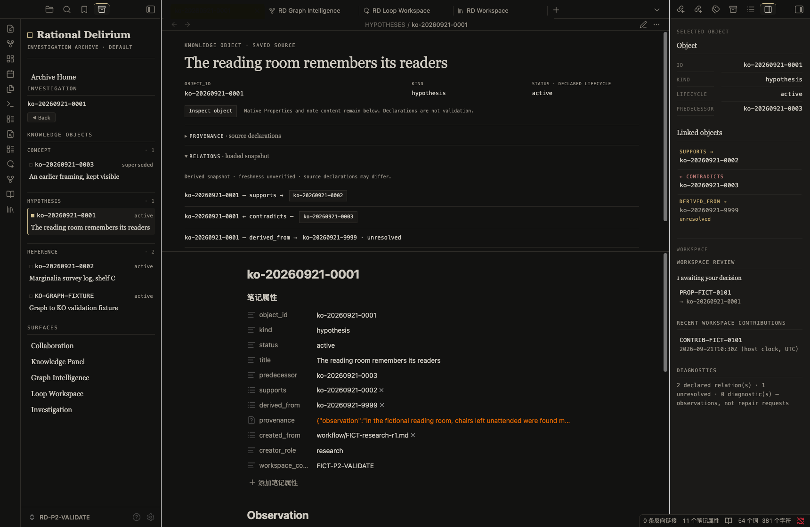

# Rational Delirium

**An Obsidian plugin for human-governed knowledge organization.**

Rational Delirium brings an archival reading and navigation experience to your notes: an Archive Home, Knowledge Object surfaces, declared relationships, provenance, and visible contribution history.

**v1.7.0 — Archive Home Experience** is the frozen baseline for personal use. Start with a copy of your Vault and the tagged build described below.

[简体中文](README_zh-CN.md) · [v1.7.0 release notes](docs/releases/v1.7.0-archive-home-experience.md)

## Overview

Markdown remains the source. Obsidian remains the environment. RD provides a knowledge presentation and organization layer inside that environment.

A Knowledge Object is a note with declared identity, type, lifecycle, and supporting context. Its appearance in RD does not certify that its claims are true. Workflow artifacts, such as proposals and contribution records, remain distinct from Knowledge Objects.

RD is not a separate database, an AI replacement, or an autonomous knowledge manager. It does not run agents or turn their suggestions into accepted knowledge automatically.

## Features

### Archive Home

Enter your personal knowledge archive through **RD Workspace**. When no object is selected, Archive Home shows:

- a landscape of declared objects, kinds, lifecycle states, and titles;
- existing Proposal and Contribution records;
- declared relations, unresolved declarations, and snapshot diagnostics.

Counts and lists describe the loaded snapshot or available artifact records, not a live census or a quality score. Returning Home preserves the session's selection history.


### Knowledge Object Surface

Read identity, provenance, relations, and lineage alongside the native Markdown experience. Inspect exact object identities and follow declared connections without replacing the underlying note.

Provenance separates Observation, Evidence, Inference, and Conclusion. Missing or unresolved information remains visible rather than being filled in by an agent or by the interface.



### Graph Intelligence

Explore declared semantic relationships, their direction, and source context. Navigate between objects while retaining provenance and explicit unresolved states.

Graph Intelligence is not Obsidian's general Markdown-link graph, a similarity engine, or a recommendation system. Relationships do not imply confidence, importance, or correctness.


*This Graph Intelligence sample has no declared relations; RD shows that empty state rather than inventing connections.*

### Inspector

The right dock keeps object context, declared fields, and diagnostics accessible while you navigate. Selection is a presentation state; selecting an object does not change its lifecycle or validate its contents.

### Obsidian Integration

RD uses real Obsidian views and dock leaves. Your Vault, native Markdown, Live Preview, Properties, and ordinary note editing remain part of the host application.

The left Archive Navigator, central Workspace, and right Inspector work together without replacing Obsidian. RD styles its own surfaces and identified Knowledge Object presentation; ordinary notes retain their native editing experience.

*Screenshots above are from the actual v1.7.0 plugin running in Obsidian 1.13.7 on macOS, using fictional validation content. They are not mockups or research evidence.*

## Quick Start

This checkpoint uses manual desktop installation. The frozen manifest requires **Obsidian 1.13.7 or later** and marks the plugin as desktop-only.

1. Obtain these four files from the frozen tag's `dist/` directory:
   - `main.js`
   - `manifest.json`
   - `styles.css`
   - `tokens-rational-archive.css`
2. Copy them into `<vault>/.obsidian/plugins/rational-delirium/`.
3. Enable Rational Delirium under Obsidian's Community plugins settings.
4. Run **Open RD Workspace** from the command palette.
5. Use **Archive Home** in the left navigator, select an existing object, or open **Collaboration** to inspect workflow records.

To build the exact checkpoint from source, with Node.js and npm installed:

```bash
git clone https://github.com/MkaliezZ/rational-delirium-ui.git
cd rational-delirium-ui
git checkout v1.7.0-archive-home-experience
npm ci
npm run build
```

Copy the four resulting files from `dist/` as described above. RD does not populate your Vault with sample knowledge or create a semantic snapshot during installation.

The release/checkpoint label is **v1.7.0**. The frozen plugin manifest still reports **0.4.4**; that is the expected installed version label for this tag, not evidence that a different checkpoint was installed. Use the tag to identify the build.

## Using Agents with Rational Delirium

External agents can assist research, prepare Knowledge Objects, and propose organizational changes. They remain contributors; humans retain knowledge authority.

```text
External Agent
      ↓
Read the RD Skill
      ↓
Prepare proposed Knowledge Object creation / organization
      ↓
Explicit Human review and scoped decision
      ↓
Human applies the approved change under the documented workflow
      ↓
Markdown in the Obsidian Vault + contribution records
      ↓
RD presentation
```

Begin with the [Rational Delirium Agent Skill](skills/rational-delirium-agent-skill.md). The bundled Skill's default workflow ends in **Human apply**. Loading it grants no write permission and does not install an agent runtime.

An agent should inspect exact object identities, preserve sources and uncertainty, and submit traceable proposals. Do not treat a proposal, model confidence, or previous approval as permission for another change. Any separately authorized external execution must stay within the explicit Human-approved scope; RD does not execute that operation for the agent.

The Collaboration surface reads `.proposals/`, `.contributions/`, and `.organization-proposals/`. The plugin can record explicit Human decisions. A decision is not truth validation, and a Contribution Record describes reported work rather than independently proving success or correctness.

## Architecture and Boundaries

```text
Obsidian Vault: Markdown declarations and workflow artifacts
   ├─ Knowledge data / derived projections → RD knowledge views
   └─ Proposal / Contribution artifacts    → Collaboration

Human decisions remain separate from Agent contributions.
```

Archive Home and Workspace consume the shared semantic snapshot. Graph Intelligence retains its existing index-derived relationship projection; the two contracts are not merged into a second source of truth. Neither view generates missing relations or repairs source knowledge.

- **Knowledge ≠ Truth**
- **Projection ≠ Authority**
- **Agent Contribution ≠ Human Decision**
- **Relationship ≠ Confidence**
- **Visibility ≠ Validation**

No confidence scores, AI ranking, automatic approval, or automatic organization are introduced by this release.

## Validation and Current Status

Frozen tag: `v1.7.0-archive-home-experience`

Runtime commit: `3d542ff22e9fd8e309201546b6609b54302dd60d`

The v1.7.0 checkpoint passed the automated suite, TypeScript checking, and build. Real Obsidian validation on macOS covered cold launch, restored workspace, warm reopen, Archive Home, Knowledge Object Surface, Inspector, Graph Intelligence, Loop, and Collaboration. Knowledge files remained unchanged during the read-only runtime checks.

Earlier workflow trials covered Codex on macOS and WorkBuddy + GLM 5.3 on Windows, including Proposal → Human Decision → Contribution Record → Relation Display. Those trials do not establish a new Windows v1.7.0 runtime result, universal agent compatibility, or autonomous approval.

## Availability and Limitations

Workspace views that depend on the semantic snapshot require a valid `semantic-graph/graph.json`. RD does not automatically generate or repair it. Missing, invalid, unavailable, and empty snapshots are distinct states. A missing snapshot does not mean the Vault has no knowledge and does not block Collaboration.

Snapshot loading does not establish freshness. An unresolved declaration reports target resolution, not a task or a verdict. Diagnostics do not certify truth. Contribution records may be incomplete and are displayed as recorded.

Use this baseline for human-led organization and exploration. It is not a background agent service, automatic conflict resolver, or replacement for your review and backup practices.

## License

[MIT](LICENSE)
