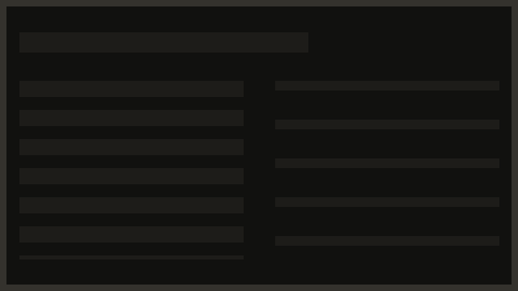
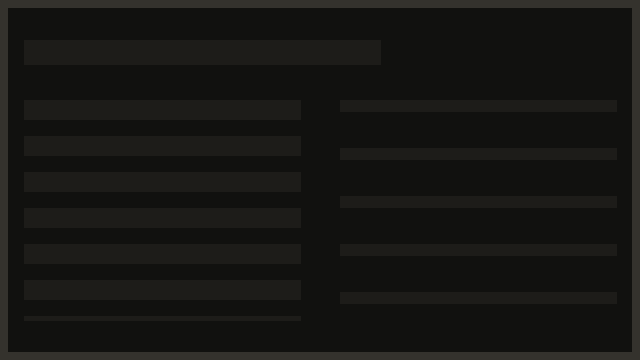

# Rational Delirium（理性谵妄）

[Obsidian](https://obsidian.md) 内的**人类治理知识工作区**——一间安静的研究档案室：
你在这里调查知识对象（溯源、谱系、关系），追踪 agent 的贡献，
而知识的一切演进都保持为**明确的人类决定**。

Rational Delirium **不是** agent 平台，**不是** agent 运行时，
也**不是**自主 AI 系统。它是一个 Obsidian 插件加一份行为技能契约：
外部 agent（Codex / Claude / Kimi / 任何其他）提案，人类决定，RD 展示。

[English](README.md)

## 架构总览

```text
KO Markdown + frontmatter          工作流工件
   （知识对象）                      （提案、记录）
        |                                   |
        | v1.2.1 投影器（仓库工具,只读）      | 由外部 agent 写入
        v                                   v
派生语义图工件 graph.json           .proposals / .contributions /
        |                            .organization-proposals
        | 只读                                |
        +----> Rational Delirium 插件 <------+
                    |  （Obsidian,除唯一受控写路径
                    |   〔人类决定记录〕外全部只读）
                    v
        人类调查与决策
                    |
                    v
        外部 agent 在 RD 之外执行已批准范围
                    |
                    v
        贡献记录 → RD 展示完整链条
```

## 工作流

```text
Agent 阅读 RD 技能
  → 检查知识对象（精确 id、溯源、关系）
  → 创建提案（markdown 工件）
  → 等待
人类在 Obsidian 中审阅 → 记录批准 / 拒绝
  （RD 唯一的写：.proposals/*.md 决定记录）
agent 仅执行已批准的范围,在 RD 之外
  → 创建贡献记录（溯源,不是证明）
RD 展示：提案 → 人类决定 → 贡献记录
```

批准授权的是一个范围。批准从不验证真相。

## 核心特性

- **知识工作区**——调查界面：身份、溯源（观察 → 证据 → 推断 → 结论）、
  谱系（前驱/后继、revises/supersedes）、关系、诊断；
  对象间导航带回退轨迹。
- **语义图投影**（`semantic-graph/projector.py`）——把声明的
  frontmatter 关系确定性地投影为派生图工件（可重建、无数据库）。
- **协作面**——只读浏览 agent 贡献、提案与组织提案；
  畸形工件保持可见；诚实的空态。
- **人类决定记录**——对 pending 提案显式 批准/拒绝；
  插件中唯一的受控写路径。
- **Agent 技能**（`skills/rational-delirium-agent-skill.md`）——
  外部 agent 的行为契约：提案、等待、仅执行已批准范围、然后记录。
- **主题系统**——语义 token，Rational Archive 默认；
  动效解释结构，从不表达含义。

## 设计原则

- **Knowledge ≠ Truth（知识 ≠ 真相）**——存储的对象记录主张与溯源。
- **Projection ≠ Authority（投影 ≠ 权威）**——出现在图中不证明任何事。
- **Agent Contribution ≠ Human Decision（Agent 贡献 ≠ 人类决定）**——提案是人类判断的输入。
- **Relationship ≠ Confidence（关系 ≠ 置信）**——声明的边不携带权重。
- **Visibility ≠ Validation（可见 ≠ 已验证）**——被展示不等于被背书。

没有真相评分、没有置信度表、没有排序、没有自动合并。

## 截图

*（占位图——真实截图稍后补充）*

| 知识工作区 | 语义图 |
| --- | --- |
|  |  |

| 协作面 | 人类决定 | 贡献记录 |
| --- | --- | --- |
|  |  |  |

## 五分钟快速开始（Obsidian）

1. **安装插件**
   ```bash
   git clone https://github.com/MkaliezZ/rational-delirium-ui
   cd rational-delirium-ui
   npm ci && npm run build
   ```
   把 `dist/`（main.js、manifest.json、styles.css、
   tokens-rational-archive.css）复制到
   `<vault>/.obsidian/plugins/rational-delirium/`，
   然后在 Obsidian 设置 → 第三方插件中启用 **Rational Delirium**。

2. **生成语义图快照**（插件只读，从不构建）：
   ```bash
   python semantic-graph/projector.py <vault> -o <vault>/semantic-graph/graph.json
   ```

3. **打开工作区**——侧边栏图标 📚 或命令 *Open RD Workspace*。
   查询精确的 `object_id`，或在中性快照列表中点击对象；
   检查身份、溯源、谱系、关系。

4. **可选——agent 工作流**：把技能
   （`skills/rational-delirium-agent-skill.md`）交给你的 agent。
   它向 `.proposals/` 提案；你在协作区审阅并决定；
   它用自己的工具执行已批准范围，并向 `.contributions/` 记录。

## Agent 工作流示例

完整的 MVP 生命周期（见
[examples/agent-workflow-example.md](examples/agent-workflow-example.md)，
虚构标识符）：

```text
提案（agent）   ：ADD_RELATION——FICT-EVIDENCE-001 supports FICT-HYPOTHESIS-001
决定（人类,在 Obsidian）：approved ← 记录的人类行为,
                          非真相验证,非对 agent 的信任
执行（agent,在 RD 外）：恰好添加声明的那一条关系
记录（agent）   ：贡献记录 → 提案 id、决定、执行的操作、受影响对象
展示（RD）      ：提案 → 决定 → 贡献 的完整链条
```

## 当前状态——已冻结（v1.10 检查点）

开发**暂停**，等待真实使用反馈
（[冻结检查点](docs/RD_FREEZE_CHECKPOINT_V1_10.md)）。

| 里程碑 | 状态 |
| --- | --- |
| v1.2.1 语义图投影 MVP | RELEASED |
| v1.3.x 呈现设计 / 智能面 / 视觉系统 / 动效 | FROZEN |
| v1.4–v1.5 协作与 Agent 工作流设计 | FROZEN |
| v1.6.x 插件架构、主题系统、知识工作区、打磨 | FROZEN |
| v1.7.x Agent 技能契约、工件、协作面 | FROZEN |
| v1.8 人类批准 Agent 工作流（首条受控写路径） | FROZEN |
| v1.9 Agent 技能工作流验证 | FROZEN |
| v1.10 真实 Agent 使用验证（DSH,5/5 PASS） | PASSED → 项目暂停 |

冻结时验证：434/434 测试全绿，tsc 干净，构建通过。

## 局限

出于设计，Rational Delirium **没有**：

- Agent 运行时——RD 从不运行、调度或调用 agent
- Agent 执行器——已批准的工作由外部 agent 用自己的工具完成
- Agent 调度器 / 后台进程
- 自动知识管理器——不自动组织、不自动晋升
- 自主 vault 变异——插件唯一的写是对 `.proposals/*.md` 的人类决定记录
- AI 裁判——没有真相评估、评分、排序或置信度

暂停期政策：仅允许 bug 修复、文档修正与安全修复。
重启需要真实使用反馈、明确的用户痛点或具体的验证需求。

## 许可证

[MIT](LICENSE)
